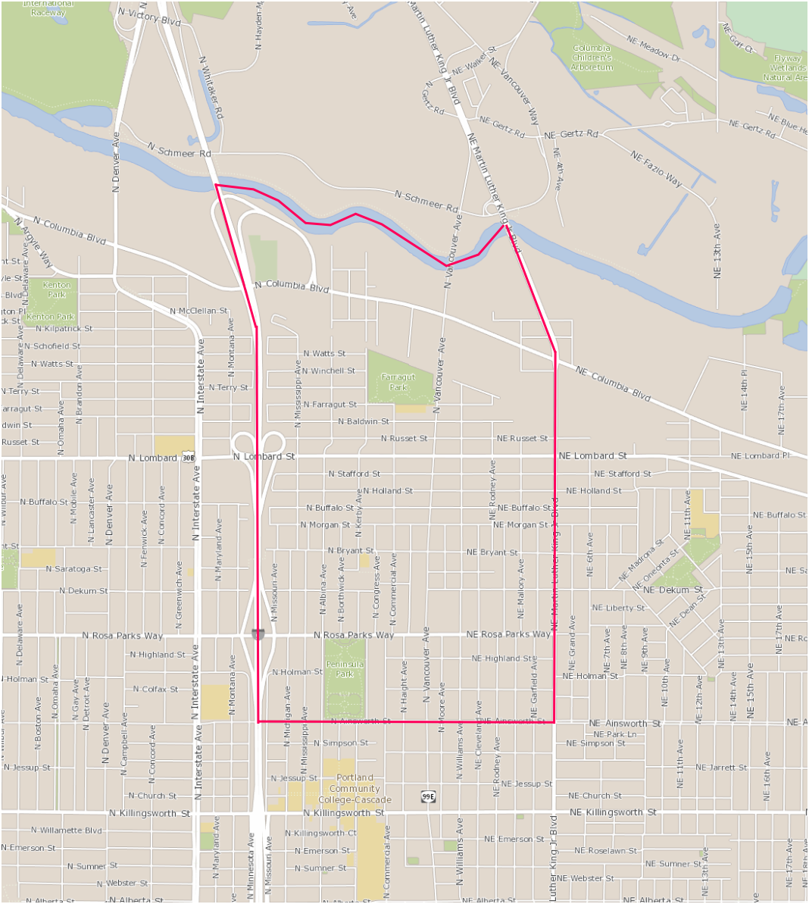

# Introduction {-}

## Piedmont {-}

Piedmont is one of the 95 neighborhoods in the neighborhood system of Portland, Oregon, and one of the eleven neighborhoods in the North Portland district coalition.

>    _Portland's nationally recognized neighborhood system is made up of 95 recognized, 
> independent neighborhood associations and seven neighborhood district coalition offices 
> that represent the entire city of Portland. 
> [https://www.portlandoregon.gov/oni/28989](https://www.portlandoregon.gov/oni/28989)_

The Piedmont neighborhood gets its name from the Piedmont subdivision, platted in 1889 by Edward Quackenbush and the Investment Company. And the Piedmont subdivision gets its name from the region in northwest Italy, known for its gentle slopes and hillsides. I am pretty sure the name Piedmont was chosen for its commercial appeal, and not for the physical resemblance with the eponymous region in Italy, which actually looks quite different. 

Although:[https://en.wikipedia.org/wiki/Piedmont_(United_States)](https://en.wikipedia.org/wiki/Piedmont_(United_States))

The Piedmont subdivision is only a small part of the Piedmont neighborhood, in fact less than ten percent of its area. And, conversely, only half of the Piedmont subdivision is in the Piedmont neighborhood, the rest is in Humboldt and King.

## Land {-}

Throughout this book, I concentrate on land and land ownership. It is essential, therefore, to remember that Oregon, Portland, and Piedmont were started by settler colonialism. This meant the United States occupied lands used for centuries by indigenous peoples, and declared it to be public lands of the United States. War, terror, vigilantes, disease, broken treaties, racism, religion, and unjust laws made sure the unceded lands stayed in the hands of the occupying forces. The small percentage of indigenous people that survived the onslaught were driven onto ever shrinking reservations. In the middle of the nineteenth century, when settlers started to arrive and Portland became a fast growing city, there were very few Native Americans left in the area.

In that nineteenth century the United States adopted laws which encouraged settlement by giving large sections of public lands away (usually tracts of 160 acres), and making other sections available for very little money (usually for $ 1.25 per acre). The land that currently makes up Piedmont was donated in this way to just four people. Evander Howe, George Smith, Lewis Love, and David Ulery were all farmers on the Vancouver Road, near the Columbia Slough. They could effectively use the Donation Land Claim Act and the Military Bounty Law, because they were the first settlers to arrive, and actually for quite some time the only settlers to arrive.

In the next stage the city grew because the settlers, or “pioneers”, sold their land to developers, who platted subdivisions. Piedmont over the years became differentiated from about four homesteads to about 30 subdivisions of varying sizes. From 1850 on fortunes were made by subdividing, exchanging, transfering, inheriting, buying, and selling pieces of land. In the third stage of development each of the subdivisions, sometimes also called additions, were partitioned into a varying number of city blocks, usually 200 by 200 feet, and the blocks were partitioned in lots, usually eight lots of 100 by 50 feet. These individual lots were then sold to people to build their houses, or packaged into multiple lots for speculation. Piedmont consists of thousands of such lots.

In the book I will discuss the original homesteads and the subsequent subdivisions. As a consequence of this emphasis on land, the book concentrates on the time between 1850 and 1930. After 1930 development is mostly down to the level of individual lots, and since there are about 5000 of these, I cannot discuss them one by one. It is interesting, of course, to find out who built an individual house, and who the subsequent owners were. But the sheer number of them makes it impossible to write about each and every one.

## Bias {-}

As you will probably figure out quickly, I like maps. I also like facts, more than I like opinions. I like words, more than I like photographs. Thus this book is not of the coffee table type, with many photos and only a few words. 

I also do not like the view that historical developments are driven by a small number of important individuals, always men of course, and that we want to know as much as possible about these men, possibly because we want to become just like them. History is driven by social and economic forces and movements in which specific individuals are of limited and largely anecdotal significance. I like to report about structures and systems more than I like to report about people. Also, I hope that what I do report about the men and women that were important in Piedmont’s early history makes it clear that you do not necessarily want to become  just like them. 

There are two other important types of Portland history books I do not want to emulate. Some of them are excellent, but they are not what I am interested in. There are those books that concentrate on vice, corruption, crime, shanghaiing, and prostitution. They are mostly about the northwest of Portland, between 1870 and 1910. And then there are those books that tell the story of city government and the business community, again mostly although not entirely about the part of Portland west of the river. As far as I am concerned, these two types of books talk about  two sides of the same coin, a bunch of people quibbling on how to divide the loot. Of course that describes a huge part of history in general, and in this book the loot is basically two square miles of land, sections 10 and 15 in township one north, range one east of the Willamette Meridian.

## Technical {-}

This book is, and always will be, free and in the public domain. Anyone can copy, print, distribute or otherwise use the material in this book for any purpose whatsoever, and, if they so choose, without attribution.

All references are collected in the back of each chapter or section. I have tried to make everything reproducible,  in the sense that every statement of fact that I make can be traced back to its sources.  I have also tried to emphasize primary (i.e. contemporaneous) sources, even if they were only newspaper articles. Secondary sources are only used, reluctantly, if primary sources are not available. I have also tried to refrain, as much as is humanly possible, from stating opinions about events, or making inferences about motives. 

This book is a living document, which means that any part of it can change at any moment. Thus all sections have a date attached to their title, indicating when they were last changed. I keep discovering new facts and adding new materials. In the table of contents each section is linked to a separate pdf, which is synchronized with the sections in the Google docs version of the book.

This book is also, among other things, a repository. There are copies of, or links to, the original maps, deeds, photos, and newspaper articles that the narrative is based on. If you see a link below a figure or a map, then following that link will usually get you to a bigger and better version of the map you can either download to your computer or view in your browser. Generally you get the best resolution by downloading the file and opening it in the appropriate application.

## References {-}

The City of Portland, Oregon. _Neighborhood Program_
[https://www.portlandoregon.gov/oni/28989](https://www.portlandoregon.gov/oni/28989)

Alta Mitchoff: _History of the Kenton Neighborhood_
Kenton Neighborhood Association, 1997

Anjala Ehelebe: _Portland’s Woodlawn Neighborhood_
Arcadia Publishing, 2008

Roy E. Roos: _The History and Development of Portland’s Irvington Neighborhood_
Self published, 1997

Roy E. Roos: _The History of Albina. Including Eliot, Boise, King, Humboldt, and Piedmont Neighborhoods_
Self published, 2008
