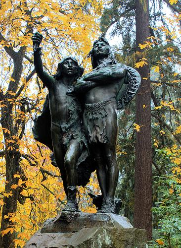
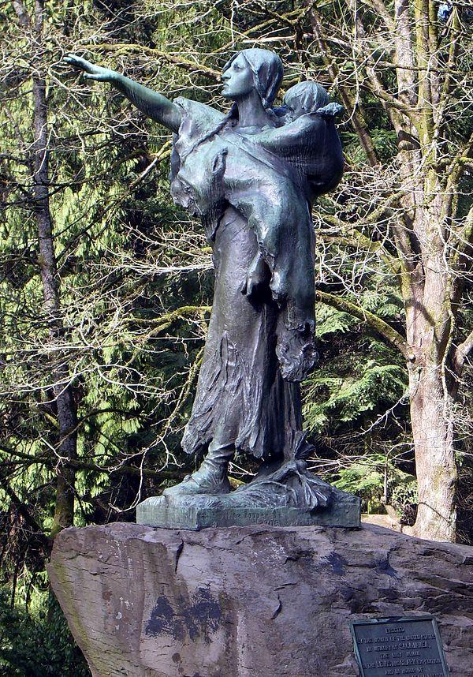

# They Were Here First. And They Are Still Here.

## Introduction

<em>They made us many promises, more than I can remember. </em>

<em>But they kept only one -- They promised to take our land ... and they took it.</em>

Red Cloud, Lakota, around 1900

It is appropriate to start this book with a chapter on the Native Americans who were here first and who lived on the land that is currently the Piedmont Neighborhood. It turns out that this is far from easy. I will have to rely heavily on a huge amount of research on relatively sparse data, documented most thoroughly in an excellent recent edited volume.

Robert T. Boyd, Kenneth M. Ames, Tony A. Johnson (eds): _Chinookan Peoples of the Lower Columbia._ University of Washington Press, 2013. 

To set the scene we start with two statues in Washington Park. The first one, on the left, is called “_The Coming of the White Man_”. The sculptor was Hermon Atkins MacNeil (1866 – 1947), who specialized in Native American scenes.  This particular statue was gifted to the City of Portland in 1904 by former mayor [David P. Thompson](https://en.wikipedia.org/wiki/David_P._Thompson). It depicts two Native American men looking towards the [Columbia River](https://en.wikipedia.org/wiki/Columbia_River) upon the arrival of [Lewis and Clark](https://en.wikipedia.org/wiki/Lewis_and_Clark_Expedition). The older man, with arms crossed, is supposedly Chief Multnomah, the younger one is not identified. Sculptor MacNeil continued to make and sell many separate copies of the Chief Multnomah figure. 

There are some problems with the statue, independent of its artistic merits. First, there is a relatively minor historical problem. For a long time historians have denied that Chief Multnomah was an actual historical figure. Recent research (Fulton, 2005), relying on the native american oral tradition, maintains that he did indeed exist. He was a powerful and important chief, who controlled a large territory around the Willamette river, and commanded many warriors. He died around 1780, possibly in the first smallpox epidemic. Whether he existed or not, he was no longer living when Lewis and Clark arrived in 1804-1805. 

The second problem, which was unavoidable at the time, is that the statue is firmly in the white supremacist tradition of the Noble Savage, the Theatrical Savage, and the Picturesque Savage  (Ellington, 2001). A good way to illustrate this is with a contemporary review of the statue by one Arno Dosch in the Pacific Monthly of 1905.

> Mr. MacNeil has put thought and genius into that old chief. He has depicted a patriarch in the full possession of his bodily strength, with a frame of iron, legs of steel cords and an arm of certain stroke. He stand on his toes to see better, binding his knees with tendons and drawing the cords over his thighs, hollowing the hips and bringing out the groin line clear. His are the legs of perfect strength, with the veins showing a little more prominently than in a younger man. On an upright body, with arms folded and a shield slung over the back, rises the head. In the face is the power. It is that of a Multnomah, a man of mental ability, a brooding savage, an Indian chief. He guided his own people by his wisdom, and let them in conquest on the enemy. The neck is drawn in heavy cords, and upon it is the chin of hauteur, almost disdain, the eyes expectant, but not astonished; the nose masterful, the strong hair bound back by a band._

The younger person is also described by Dosch.

>    _His attitude is in direct contrast to that of his elder. His whole body and face expresses open curiosity and wonderment. He holds aloft on his right hand a branch, just broken from a tree, and waves it as a token of good will to the strangers._

At some point in time in the 1930’s someone, presumably someone with a more keen sense of history, broke off this olive branch from the statue. It has not been restored.

Remember that Arno Dosch wrote in 1905. In the preceding 100 years an estimated ninety percent of the Native American population had disappeared. They largely succumbed to diseases brought by the white man. But they had also been hunted down and killed by vigilantes and slaughtered in staged so-called “Indian Wars” by the army. They were driven from their lands, tricked into signing treaties that would never be ratified, and they were forcibly removed to areas east of the Cascades, or driven onto small reservations of land that the white settlers did not want. In 1905 the expression on the face of Chief Multnomah should have alternated between immense sadness and equally immense rage. 

The second statue in Washington Park, the picture on the right,  is “_Sacajawea and Jean-Baptiste_”. The sculpture was commissioned for the [Lewis and Clark Centennial Exposition](https://en.wikipedia.org/wiki/Lewis_and_Clark_Centennial_Exposition) (1905) by the Committee of Portland Women, who requested a sculpture of "_the only woman in the Lewis and Clark Expedition and in honor of the pioneer mother of old Oregon_."

## Before Contact

Archeology

## Discovering the Columbia

## The Lewis and Clark Journals

The two visits to Native American sites in the Columbia Basin/Wapato Valley

## The Wapato Valley Native Americans

## The Spirit of Pestilence

## The Extinction of Indian Title

How the lands were taken away (In the Courts of the Conqueror, Conquest by Law).

>    _There has been some discussion as to the origin of our title to what was known as the Oregon country, comprising the State of Oregon, Washington and Idaho, and the portions of Montana and Wyoming west of the Rocky Mountains. The question wa whether our title was derived from the Louisiana Purchase or directly by discovery and prior possession. As the result of discussion by the General Land Office in 1898, the map of the United States now issued by that office states that the title was established in 1846. The exact basis of our claim has apparently never been authoritatively decided (Bien, 1910, page 388)._

## Present Day Multnomah County

## References

Morris Bien: _The Public Lands of the United States._
The North American Review, 192, 1910, 387-402
[https://drive.google.com/file/d/1TT_lgoh_nI8LSdztGw_claFQYfHje16G](https://drive.google.com/file/d/1TT_lgoh_nI8LSdztGw_claFQYfHje16G)

Jerry A. O’Callaghan: _The Disposition of the Public Domain in Oregon_
Dissertation submitted to the Department of History and the Committee on Graduate Study of Stanford University, November 1960
[https://drive.google.com/file/d/1T8HRj39qobQ_4NkydJpagwnRQvFPAEUB](https://drive.google.com/file/d/1T8HRj39qobQ_4NkydJpagwnRQvFPAEUB)

Gary E. Moulton (ed): _The Lewis and Clark Journals. An American Epic of Discovery. The Abridgment of the Definitive Nebraska Edition. _University of Nebraska Press, 2004

Gary E. Moulton (ed): _The Definitive Journals of Lewis & Clark. Down the Columbia to Fort Clatsop. _Volume 6 of the Nebraska Edition. University of Nebraska Press, 1990.

Gary E. Moulton (ed): _The Definitive Journals of Lewis & Clark. From the Pacific to the Rockies. _Volume 7 of the Nebraska Edition. University of Nebraska Press, 1991.

Robert T. Boyd, Kenneth M. Ames, Tony A. Johnson (eds): _Chinookan Peoples of the Lower Columbia._ University of Washington Press, 2013. 

Michael Silverstein: _Chinookians of the Lower Columbia. _In Wayne Suttles (ed): _Handbook of North American Indians, Volume 7, Northwest Coast_, p 533-546. Washington, Smithsonian, 1990.

Robert H. Ruby and John A. Brown: _The Chinook Indians. Traders of the Lower Columbia River. _University of Oklahoma Press, Norman, Oklahoma, 1976.

Robert H. Ruby, John A. Brown, Cary C. Collins: _A Guide to the Indian Tribes of the Pacific Northwest._ University of Oklahoma Press, Norman, Oklahoma, Third Edition, 2010.

Ann Curry-Stevens, Amanda Cross-Hemmer, Coalition of Communities of Color:_ The Native American Community in Multnomah County. An Unsettling Profile. _Portland State University, School of Social Work, 2011. [https://pdxscholar.library.pdx.edu/cgi/viewcontent.cgi?article=1093&context=socwork_fac](https://pdxscholar.library.pdx.edu/cgi/viewcontent.cgi?article=1093&context=socwork_fac)

Robert A. Williams, Jr: _The American Indian in Western Legal Thought._ _The Discourses of Conquest. _Oxford University Press, 1990

Robert A. Williams, Jr: _Savage Anxieties._ _The Invention of Western Civilization. _Palgrave McMillan, 2012

Ann Fulton: _The Restoration of Iłkák'mana: A Chief Called Multnomah. _American Indian Quarterly, 31, 2007, 110-128

Ter Ellington: _The Myth of the Noble Savage_. University of California Press, 2001. 

Lindsay G. Robertson: _Conquest by Law. How the Discovery of America Dispossessed Indigenous People of their Lands. _Oxford University Press, 2005

Walter R. Echo-Hawk: _In the Courts of the Conqueror. The 10 Worst Indian Law Cases Ever Decided. _Fulcrum Publishing, 2012.

Arno Dosch: _The Coming of the White Man. _The Pacific Monthly, 13, 1905, 50-52

The Native American Community in Multnomah County:
