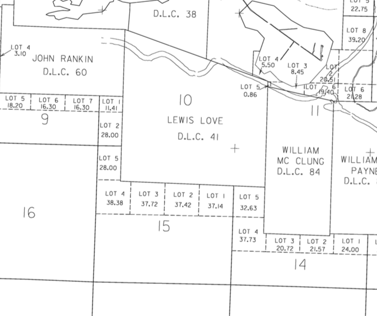
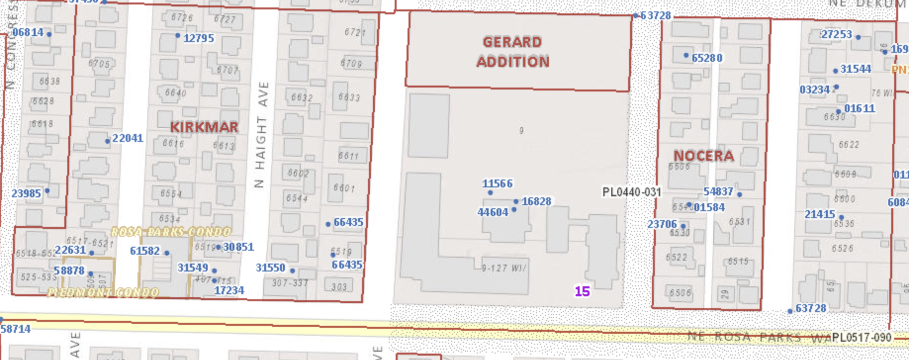
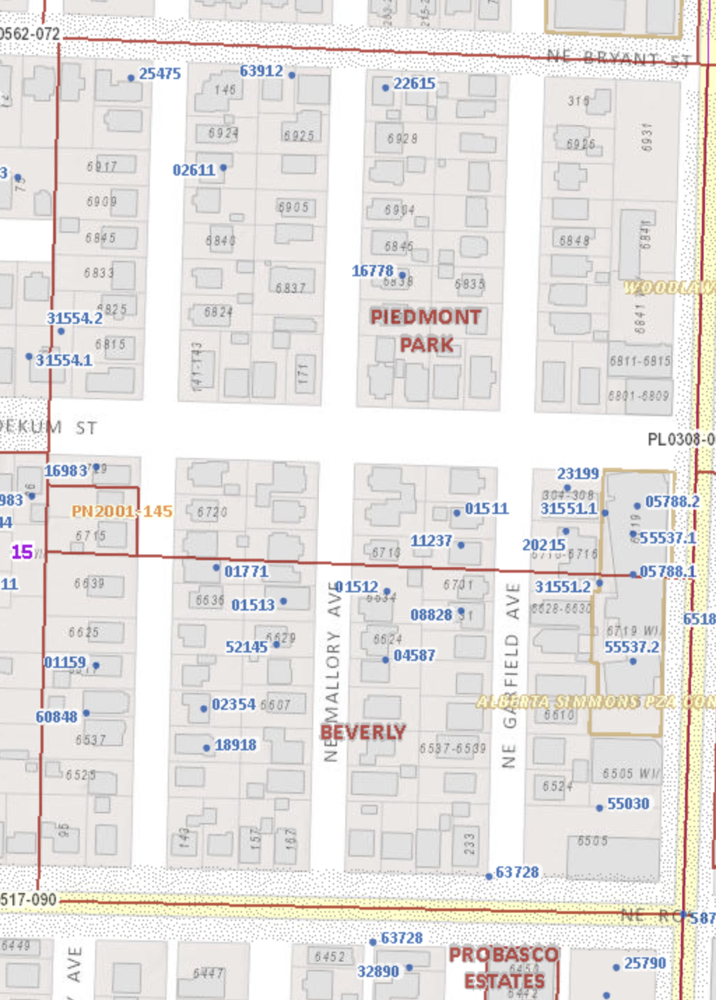
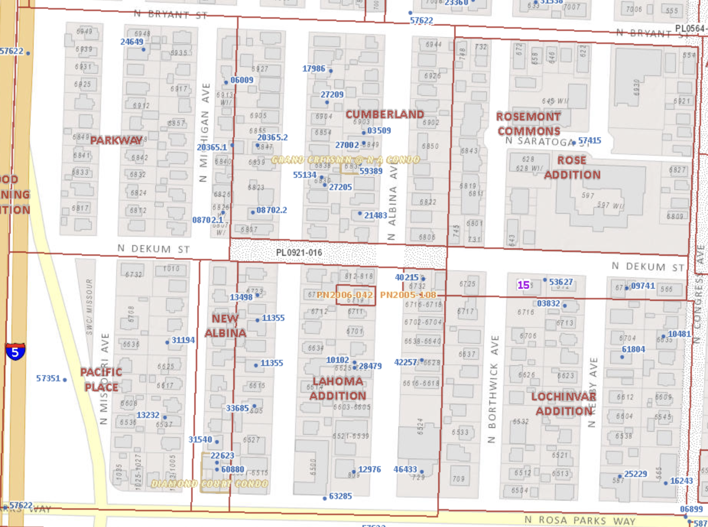
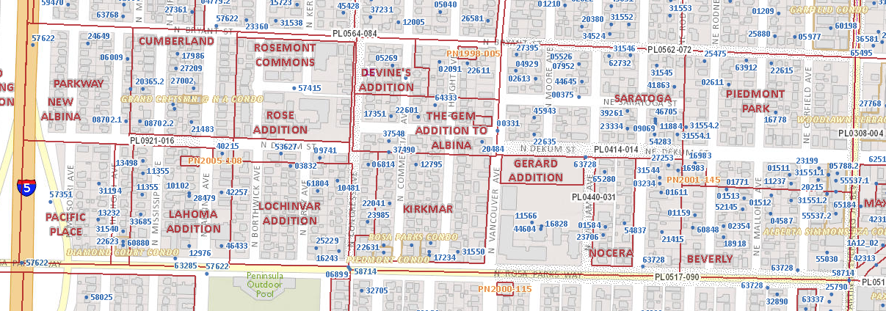
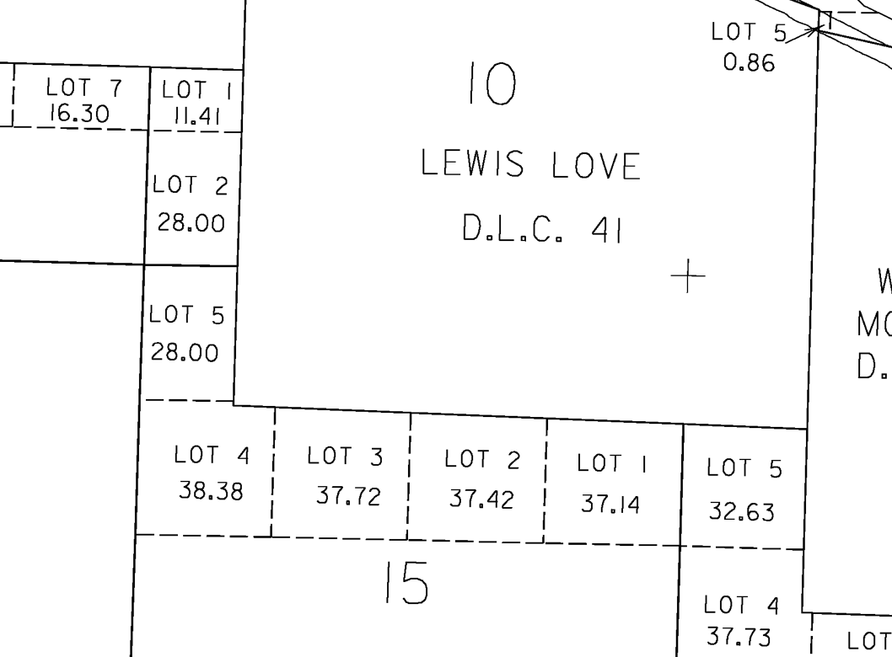
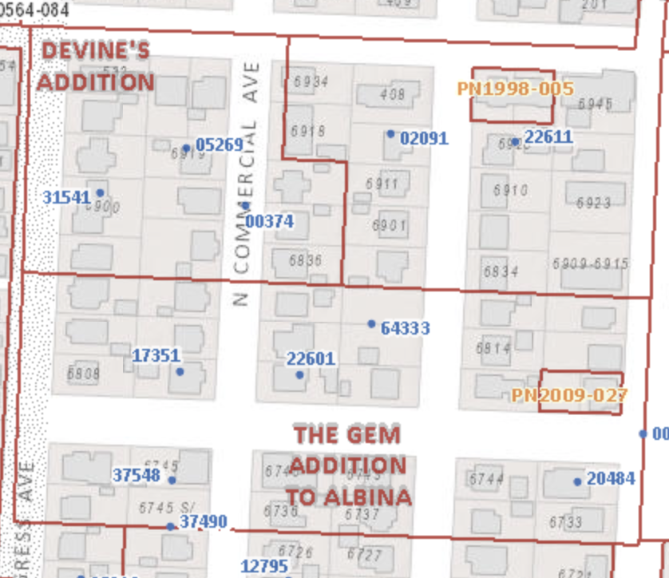

## Homesteads: David and Martha Jane Ulery

### Homestead

Between Bryant Street and Portland Boulevard (now Rosa Parks Way), from Union Avenue (now MLK) to what is now Missouri, were three lots of public land, each about 37 acres. Together with another 32 acre lot, numbered 5, in Section 14 (now in Woodlawn), they were included in a Military Bounty Land Warrant of 160 acres given to A-Chars-War-Chee (MW-0229-025, dd 12/10/1864), who immediately transferred the land to David Ulery (or Ullery).

>   _To all to whom these Presents shall come, Greeting. Whereas, in pursuance of the Act of Congress, approved March 3, 1855, entitled “An Act in addition to certain Acts granting Bounty Land to certain Officers and Soldiers who have been engaged in the military service of the United States” there has been deposited in the General Land Office, Warrant No. 93230 for 160 acres, in favor of A Chars War Chee, Warrior Captain Paddy Carrs Company Creek Volunteers Creek War with evidence that the same has been duly located upon the fractional South East quarter of the North West quarter, the fractional South half of the North East quarter (or lots numbered one, two, and three) of Section Fifteen and the South West quarter of the North West quarter (or lot numbered five) in Section Fourteen in Township One North of Range One East in the district of lands subject to the sale at Oregon City Oregon containing one hundred and forty four acres and ninety one hundredths of an acre according to the Official Plat of the Survey of said Lands returned to the General Land Office by the Surveyor General. The said Warrant having been assigned by the said A. Chars War Chee to David Ulery in whose favor said tract has been located. _

>    _Now know ye that there is therefore granted by the United States unto the said David Ulery as assignee as aforesaid and to his heirs to tract of Land above described: To Have and To Hold the said tract of Land with the appurtenances thereof, until the said David Ulery as assignee as aforesaid and to his heirs and assign forever._

>    _In testimony whereof, I, Abraham Lincoln, President of the United States of America, have caused these letters to be made patent, and the Seal of the General Land Office to be hereunto affixed._

>    _Given under my hand, at the City of Washington, the tenth day of December in the year of our Lord one thousand eight hundred sixty four and of the Independence of the United States the Eighty Ninth. By the President (signed) Abraham Lincoln. By (signed) Edw D Neill, Sec’y. (signed) J.M. Granger, Recorder or the General Land Office._

    _[https://drive.google.com/open?id=0B94Urj3OjM7BczdjVDk0NlZJMmc](https://drive.google.com/open?id=0B94Urj3OjM7BczdjVDk0NlZJMmc)_

The tax lots are more clearly shown on the map below. Note that tax lots 4 and 5 on the west side of section 15, which includes the small strip of modern Piedmont between Missouri and the freeway, were in the homestead of John Fenstermacher.

In 1882 Ulery sold his Portland properties and moved to the Chelatchie Valley in Clark County. On the David Ulery DLC the subdivisions of Beverly, Piedmont Park, Parkway, Saratoga, Nocera, Kirkmar, Gem Addition, Rose Addition, Lochinvar, Lahoma, and Cumberland were created.

### Sales (First Phase)

On May 2, 1863 David and Martha Jane Ulery sold part of their land to John Hotts. Note that this was even before the land was formally assigned to David Ulery by the United States. Here is the deed. 

>    _This indenture witnesses that we David Ulery and Martha Jane Ulery his wife for the consideration of Sixty two dollars to us paid have bargained and sold and by those presents do bargain, sell and convey to John Hotts the following described premises to wit: the fractional South East quarter of the North West quarter in Section fifteen in Township One North of Range One East containing thirty seven acres and seventy two one hundredth. To have and to hold the said premises with their appurtenances unto the said John Hotts his heirs and assigns forever. And I the said David Ulery do hereby covenant to and with the said John Hotts his heirs and assigns that I am the owner in fee simple of said premises, that they are free of all encumbrances and that I will warrant and defend the same from all lawful claims whatsoever. Witness our hands and seals this 2nd day of May AD 1863. (signed) David Ulery (signed) Martha Jane Ulery_

    _[https://drive.google.com/file/d/1Q2f1OAYB4G4sSQ5DH9SI9wLx5rS2DrEa](https://drive.google.com/file/d/1Q2f1OAYB4G4sSQ5DH9SI9wLx5rS2DrEa)_

It is pretty clear from this description that what was sold here is what is lot 3 on the map, the most western part of the DLC. 

In the second step the Ulery’s sold lot 5, the part in Section 14, currently in Woodlawn, to Silas Jones for $ 1,050. The deed was recorded on December 19, 1881.

[https://drive.google.com/open?id=1C2Y59TD9k1_Jpt4FgoAvi7_1Oyme24PM](https://drive.google.com/open?id=1C2Y59TD9k1_Jpt4FgoAvi7_1Oyme24PM)

The next deed records the sale of 25 acres to Lewis Washington Love, son of William Love, and grandson of Lewis Love. It was recorded on February 1, 1882.

>    _Know all men by these Presents : That we David Ulery and Martha J Ulery wife of said David Ulery of the County of Multnomah and State of Oregon, in consideration of Seven hundred (700) dollars to us paid by Lewis W. Love of said Multnomah County State of Oregon do hereby grant bargain sell and convey to said Lewis W. Love and to his heirs and assigns forever the following described parcel of real estate to wit: Being a part of Section Fifteen (15) in Township One (1) North Range One (1) East of Willamette Meridian and bounded as follows to wit: Beginning at a stake on the boundary line between sections fourteen (14) and fifteen (15) in said Township and on the South boundary of the Lewis Love Donation Land Claim and running from thence South eighteen (18) chains and eighteen (18) links to the quarter Section post between said sections fourteen and fifteen. Thence West thirteen chains (13) and seventy five (75) links to a post. Thence North eighteen (18) chains and thirteen (13) links to the South boundary of said Love land claim. Thence East along the South boundary of said land claim thirteen (13) chains and Seventy five links to the place of beginning, containing twenty five acres of land in the said County of Multnomah State of Oregon._

    [https://drive.google.com/open?id=1Pkg_9J7pJbt2aGqM71KIZp8SUPG3_Gp9](https://drive.google.com/open?id=1Pkg_9J7pJbt2aGqM71KIZp8SUPG3_Gp9)

To translate 18 chains and 18 links is 1200 feet, 18 chains and 13 links is 1196.6 feet, and

13 chains and 75 links is 907.5 feet. Thus basically this is the east 25 acres of lot 1. The next three deeds were also recorded on February 1, 1882. We transcribe the key parts.

>    _Know all men by these Presents : That we David Ulery and Martha J Ulery wife of David Ulery of the County of Multnomah and State of Oregon, in consideration of Twelve hundred &lt;1200> dollars to us paid by Florence Meade of the said Multnomah County State of Oregon do hereby grant bargain sell and convey to said Florence Mead and to her heirs and assigns forever the following described parcel of real estate to wit: Being a part of Section Fifteen &lt;15> in Township One &lt;1> North Range One &lt;1> East of Willamette Meridian and bounded as follows to wit: Beginning at a post in the Center of the Vancouver road said post being in the South boundary line of the Lewis Love Donation Land claim eighteen &lt;18> chains and sixty seven &lt;67> links North of the Stone monument at the center of Section Fifteen &lt;15> in Township one North Range One &lt;1> East Willamette Meridian and Eleven &lt;11> chains and Seventy five &lt;75> links Easterly of said monument and running from thence South forty five &lt;45> minutes West along the Vancouver County Road nine &lt;9> chains and eighteen (18) links to the North line of a certain twenty five (25) acre tract. Thence East along the North line of said tract fifteen chains to a point thence North Eight &lt;8> chains and Eighty &lt;80> links to the South line of the Lewis Love Donation Land Claim thence North 89 degrees 30 minutes West along the said boundary line of said Love claim fourteen &lt;14> chains and 99 links to the place of beginning containing 13 38/100 acres of land._

    _[https://drive.google.com/open?id=1Q3cmINUpsdgSevedjngBoH8ntSKsPnmE](https://drive.google.com/open?id=1Q3cmINUpsdgSevedjngBoH8ntSKsPnmE)_

>    _Know all men by these Presents : That we David Ulery and Martha J Ulery wife of the said David Ulery of the County of Multnomah and State of Oregon, in consideration of Twenty five hundred &lt;2500> dollars to us paid by Sarah McMillen of the said Multnomah County State of Oregon do hereby grant bargain sell and convey to said Sarah McMillen and to her heirs and assigns forever the following described parcel of real estate to wit: situated in the said County of Multnomah and bounded as follows: Beginning at a Stone in the center of Section Fifteen &lt;15> in Township One North Range One &lt;1> East: thence East twenty six chains and 62 links to a post; thence North nine (9) chains and thirty nine &lt;39> links to a post; thence West parallel with the South side line twenty six chains and sixty two (62) links to a stone; thence South Nine &lt;9> and thirty nine &lt;39> links to the place of beginning containing twenty five acres of land._

    _[https://drive.google.com/open?id=1Q2rR3Q3QsmvySkHXgdclIzCoOZTP -QNl](https://drive.google.com/open?id=1Q2rR3Q3QsmvySkHXgdclIzCoOZTP-QNl)_

>    _Know all men by these Presents : That we David Ulery and Martha J Ulery of the County of Multnomah and State of Oregon (Martha J. Ulery being the wife of the said David Ulery), in consideration of Twelve hundred &lt;1200> dollars to us paid by Terzah B. McMillen of the said County of Multnomah do hereby grant bargain sell and convey to said Terzah B. McMillen and to her heirs and assigns forever the following described parcel of real estate to wit: situated in the said County of Multnomah State of Oregon and bounded by beginning at a point nine (9) chains and thirty nine (39) links North of a stone set at the center of Section fifteen in Township one (1) North Range one (1) East and running from thence north nine (9) chains and twenty eight (28) links to the stone monument in the South boundary line of the Lewis Love Donation Land Claim. Thence South 89 degrees (89˚) and thirty (30) minutes (30’) East along said Donation Claim line eleven chains and seventy five (75) links to center of Vancouver County Road. Thence South 45 minutes (0˚ 45’) W. nine (9) chains and eighteen (18) links to the north line a certain twenty five acre tract, thence west eleven (11) chains and sixty two (62) links to the place of beginning containing ten acres and seventy seven hundredths of land._

    _[https://drive.google.com/open?id=1Q10BF7FtoueSKOO9elULOmFD2L23xo1S](https://drive.google.com/open?id=1Q10BF7FtoueSKOO9elULOmFD2L23xo1S)_

I can summarize all four transactions in a picture, showing how tax lots one, two, and three were divided. I used a modern map to draw the boundaries on, but of course none of the streets were there in 1882, except Vancouver Road. Also, there is no guarantee that the boundaries are precise to within the millimeter, but it’s a pretty good approximation.

    [https://drive.google.com/open?id=18J7V0CGXE1adVcPZOBAwwANgSH4XmGJj](https://drive.google.com/open?id=18J7V0CGXE1adVcPZOBAwwANgSH4XmGJj)

Compare this with a modern subdivision map. We see that the Lewis Love piece was subdivided into Beverly and Piedmont Park. The Florence Mead part became Saratoga. The Sarah McMillen part became Kirkmar, Nocera, and the Gerard Addition, as well as the Holy Redeemer complex. The Terzah McMillen part became the Gem Addition and Devine’s Addition. The John Hotts part became Lahoma, Lochinvar, Cumberland, Pacific Place, Parkway, New Albina, and the Rose Addition.

The David Ulery homestead illustrates clearly the general mechanism of larger pieces of land being sold in smaller pieces, introducing more owners, and eventually resulting in many subdivisions from a small number of homesteads. More to the north the Lewis Love DLC was partitioned into relatively large pieces, but the David Ulery DLC became fractured early on. This partitioning into subdivisions also allows us to answer discomforting existential questions such as “Why does NE Rodney Ave not continue in a straight line at Bryant ?” or “Why does NE Saratoga St stop at its east end before it gets to NE Rodney Ave ?”. 

### Sales (Second Phase)

In the first phase of sales we started with a military donation claim of 144 acres, consisting of four tax lots of 37 acres. It was divided into six parcels, of which five were in the modern Piedmont neighborhood. As I indicated in the introduction, I will actually try to follow the title chains to the next level, where these five larger parcels will be partitioned into subdivisions. Bear with me, this will get complicated. 

Nobody in the first set of buyers (John Hotts, Sarah McMillen, Terzah McMillen, Florence Meade, Lewis Washington Love) thought of actually platting and developing the land. The second phase started at the time of the consolidation of Albina, the relentless boosting by McKenna, Killingsworth, and Quackenbush, and the coming of bridges, railways, and streetcars on the East Side. All these parcels rapidly went up in value when Piedmont was platted in 1889. Sales picked up, plats were filed, and early investors made a nice profit. In many cases buyers sold in the same year they bought, and nevertheless making a considerable profit.

#### Lewis Washington Love

Let’s start with the twenty five acres that Lewis Washington Love bought from Ulery. He sold them for $ 3,125 to W. G. Jenne on September 22, 1882. 

[https://drive.google.com/open?id=1AeyvCQDgk2Hzsy2hiAAmePk9hGdAOprF](https://drive.google.com/open?id=1AeyvCQDgk2Hzsy2hiAAmePk9hGdAOprF)

##### Piedmont Park

On February 20, 1889 W. G. and Ida J. Jenne sold the northern 15 acres, the section that would become Piedmont Park, to G. W. Stearns for $ 7,500. 

[https://drive.google.com/open?id=1Bnm-HAauK5hZohLcjlSqln5wZOVRW13f](https://drive.google.com/open?id=1Bnm-HAauK5hZohLcjlSqln5wZOVRW13f)

There is an interesting clause in the deed.

>    _… together with the right of road over the east 30 feet of the 10 acre tract of land adjoining the south boundary of above conveyed tract of land and saving and excepting a like right of road over the said 15 acre tract above conveyed, said rights to last till both of said tracts are made accessible by public road to both the Woodlawn Station and the Vancouver road and no longer._

G. W. and Josephine C. Stearns in turn sold the parcel for $ 9,000 to D. B. Monteith on February 26, 1889.

    [https://drive.google.com/open?id=1ML8wCkaoPr79fW_hHkGa82QVcbPMWRlj](https://drive.google.com/open?id=1ML8wCkaoPr79fW_hHkGa82QVcbPMWRlj)

And D. B. and Irma M. Monteith sold to J. P. and Louise M. Menefee, F. W. and Ida E. Torgler, and Charles C. and Emma Woodcock on February 23, 1891 for $ 13,500.

[https://drive.google.com/open?id=12pittgegX7YngO43wen-8rmJCq2ReQFd](https://drive.google.com/open?id=12pittgegX7YngO43wen-8rmJCq2ReQFd)

Those same three couples filed the plat for Piedmont Park on June 5, 1891.

##### Beverly

The southern 10 acres were more of a problem. I have not figured this one out completely yet. Clearly Jenne was unable or forgot to pay his property taxes, because Sheriff George C. Sears sold the parcel on November 26, 1894 to E.S. Rash for $ 50.00.

[https://drive.google.com/open?id=1c_R6kSraX5bRp-F_YsVsRYNX86PdHE6-](https://drive.google.com/open?id=1c_R6kSraX5bRp-F_YsVsRYNX86PdHE6-) 

[https://drive.google.com/open?id=18GqNBpgRIBQskNp7KwteuuQvzoJh2xT1](https://drive.google.com/open?id=18GqNBpgRIBQskNp7KwteuuQvzoJh2xT1)

#### Florence Meade

##### Saratoga

The 13.38 acres that are now Saratoga have a relatively simple story. We have seen they were sold by the Ulery’s to Florence Meade for $ 1,200 on February 1, 1882. W. H. and Florence Meade in turn sold them for $ 2,750 to Julius E. Sorbin of Albany on October 17, 1882. 

[https://drive.google.com/open?id=1KLX7BJODfJs3j9rXvTBeuPeE3nSyj8CU](https://drive.google.com/open?id=1KLX7BJODfJs3j9rXvTBeuPeE3nSyj8CU)

Sorbin quitclaimed them to Hardy C. Wortman for $ 1.00 on March 28, 1889. 

[https://drive.google.com/open?id=15YaEpNWuV32RXssr8tE_Rjedt8inY-bL](https://drive.google.com/open?id=15YaEpNWuV32RXssr8tE_Rjedt8inY-bL)

And finally Wortman filed the plat for Saratoga on March 30, 1889. Both Mr. Wortman and the Saratoga subdivision have their separate chapters in this book.

#### Sarah McMillen

The 25 acres that Sarah McMillen bought from the Ulery’s for $ 2,500 on February 1, 1882 were transferred on August 5 of the same year by R. H. McMillen and his wife Sarah to Orlando Rossi for $ 3,750.

[https://drive.google.com/open?id=1eGovVTgQl9t6wy-RwZT-0hLwj5jQFX-Q](https://drive.google.com/open?id=1eGovVTgQl9t6wy-RwZT-0hLwj5jQFX-Q)

On August 29 of 1882 Orlando and Mathilda Rossi sold the parcel for $ 5,000 to George Marshall.

[https://drive.google.com/open?id=1yxfTlUA1IIOKgnwmR2iNfxqZSC1MQR1w](https://drive.google.com/open?id=1yxfTlUA1IIOKgnwmR2iNfxqZSC1MQR1w)

The next transaction I have found is a quitclaim for $ 1.00 by George Marshall to his wife Margaretta Kirk-Marshall on April 30, 1884. 

[https://drive.google.com/open?id=1TJT-hBNQ5H1WqyNsFAb-PZg9TLSq3NFi](https://drive.google.com/open?id=1TJT-hBNQ5H1WqyNsFAb-PZg9TLSq3NFi)

The Marshall family, who have their own chapter in this book, were in the habit of transferring their real property to other members of the family when they got older and/or sicker, probably to avoid probate, executors, appraisers, and taxes. The probate file for George Marshal shows basically that at his death there was nothing left in the estate, and the executor of the estate (his wife) had an easy job. 

[https://drive.google.com/open?id=1sHPTMHOAw8sQwdT8zWILltRa6XS1AZS7](https://drive.google.com/open?id=1sHPTMHOAw8sQwdT8zWILltRa6XS1AZS7)

##### Kirkmar

There are two Margaretta Marshalls to be considered. The first is Margaretta Kirk-Marshall, who died in 1897. She left an estate worth almost $ 100,000, mostly consisting of real property, but the parcel in the Piedmont Neighborhood was not mentioned in the probate file. 

[https://drive.google.com/open?id=1f7eJnJneqAYa3_yv-8K96VM1CYHH2O96](https://drive.google.com/open?id=1f7eJnJneqAYa3_yv-8K96VM1CYHH2O96)

The second Margaretta is the daughter Margaretta A. Marshall, who in April 1929, with her sister Vidae L. Marshall and her niece M. Genevieve Jones, platted the 8.08 acres of the western part of the Sarah McMillan parcel, between Congress and Vancouver, as Kirkmar. Presumably the name Kirkmar is derived from Kirk-Marshall. 

The 100 by 450 feet chunk (1.03 acres) at Congress ? Why ? Must have been sold by Marshall’s rather early on.

##### Nocera

The eastern part. First the 2 ⅚ acres that later becomes Nocera.

>    _Beginning on the quarter section line running east and west through the center of section 15, in Township one (1) north of range one (1) east, at a point 1130 feet west of the east line of said section; which said point is at the southwest corner of a parcel of land containing three and one-sixth (3 ⅙) acres heretofore conveyed to one Gustave M. Keller and running thence north six hundred nineteen and 74/100 (619.74) feet; thence west on a line parallel with said quarter section line two hundred (200) feet; thence south six hundred nineteen and 74/100 (619.74) feet; thence east and along said quarter line two hundred (200) feet to point of beginning, containing two and five-sixths (2-⅚) acres of land, be the same more or less._

Helen O. Stoppenbach for $ 5,000 to the Reverend William T. Bond on May 17, 1906, Book 364 Page 48

[https://drive.google.com/open?id=15h9n3ps0Xf5Zyjhc5jJUFv3j13Zqq7DX](https://drive.google.com/open?id=15h9n3ps0Xf5Zyjhc5jJUFv3j13Zqq7DX)

The Reverend William T. Bond, unmarried, of Kansas City, Missouri to the Very Reverend Joseph A. Firle of St. Louis, Missouri for $ 5,000 on March 4, 1907.

[https://drive.google.com/open?id=1U9152Iczi_eLQgW73VpOKRD_xwpMGy9g](https://drive.google.com/open?id=1U9152Iczi_eLQgW73VpOKRD_xwpMGy9g)

The Provincial of the order, the Very Reverend Joseph A. Firle, unmarried, of St. Louis, Missouri to Society of Redemptorists Fathers for $ 10 on July 18, 1907.

[https://drive.google.com/open?id=1hURir6D96BavyHG9oqakCxs2gPfTxDSp](https://drive.google.com/open?id=1hURir6D96BavyHG9oqakCxs2gPfTxDSp)

Also: June 1806, Redemptorist Fathers William Bond and Joseph Bell bought 6 acres for $ 12,000. Monday Oregonian March 15, 1907. (??)

On March 6, 1907 Mary E. Marsh, Margaretta Marshall, and Vidae L. Marshall (all unmarried) sold 8.2936 acres to the Redemptorist Fathers for $ 18,622.28 dollars

[https://drive.google.com/open?id=1BMJ_4OM8acJgwgkpoWRBK10Msji5zy-S](https://drive.google.com/open?id=1BMJ_4OM8acJgwgkpoWRBK10Msji5zy-S)

And then there is Gustave Keller. He bought the easternmost 3 ⅙ acres of the Sarah McMillen tract from Mary E. Marsh, Margaretta Marshall, and Vidae L. Marshall for $ 1058,33 on April 9, 1908.

[https://drive.google.com/open?id=1TJrNLv0tHmmLgt_N9R_H-LDtXD-Dq5qB](https://drive.google.com/open?id=1TJrNLv0tHmmLgt_N9R_H-LDtXD-Dq5qB)

This part was never platted. There is some interesting history here, which we review in the chapter on Gustave and Amalia Keller.

#### Terzah B. McMillen

South 5.385 acres of 10.77 acres. Becomes Gem Addition. 

The undivided one half from James H. and Terzah B. McMillen to George F. Wells and V. K. Strode for $ 1,500 on January 3, 1883. 

[https://drive.google.com/open?id=1Gra4CIM3rgHxwfN4J5JuyxxlbXxuikwn](https://drive.google.com/open?id=1Gra4CIM3rgHxwfN4J5JuyxxlbXxuikwn)

The south half from V. K. and Katie Strode and George F. and Lizzie Wells to Mark Jarrett for $ 1,614.00 on October 16, 1888.

[https://drive.google.com/open?id=1VgbMb9qrlMiRiMfEJcU_UXwGCVlHaAYZ](https://drive.google.com/open?id=1VgbMb9qrlMiRiMfEJcU_UXwGCVlHaAYZ)

Trust deed for the southern 5 acres Lula J. Jarrett to Henry George, Bk 121 Page 437. April 15, 1889.

Henry A. and M. V. George quitclaim for $ 10 to Lula J. Jarrett on October 30, 1889.

[https://drive.google.com/open?id=1TxO8fdHAkJtmOyeUNV9-jV2b19j7IsBk](https://drive.google.com/open?id=1TxO8fdHAkJtmOyeUNV9-jV2b19j7IsBk)

Lula J. Jarrett to William Kincaid 5.38 acres for $ 1 on February 25, 1890.

[https://drive.google.com/file/d/1Kk6QgcMRFPnn1U6JgP681X-UaxYRIxYK](https://drive.google.com/file/d/1Kk6QgcMRFPnn1U6JgP681X-UaxYRIxYK/view?usp=sharing)

Charles K. and Lydia Henry plat the Gem Addition to Albina on March 24, 1890.

Northern half: becomes Devine’s Addition (about 2.2 acres). 

Mary C. and George E. Smith 3 acres to Rose A. Woodard on May 12, 1903 for $ 3,150.

[https://drive.google.com/open?id=1CWTgQaaESLtU0QzNMSPYMlBYnudLkRtg](https://drive.google.com/open?id=1CWTgQaaESLtU0QzNMSPYMlBYnudLkRtg)

Mary C. and George E. Smith 2.2 acres to Patrick J. Devine on April 1, 1909 for $ 10.

[https://drive.google.com/file/d/1_WYa6Eh2yAGG_scNXSjRWUi_vrLYDm0y](https://drive.google.com/file/d/1_WYa6Eh2yAGG_scNXSjRWUi_vrLYDm0y/view?usp=sharing)

Patrick J. and Minnie E. Devine platted on June 17, 1909.

#### John Hotts

If you think the second wave of sales was complicated for the McMillen pieces, then wait till you hear what happened to the 37.72 acres sold (for $ 62) to John Hotts. I am still pretty far from resolving all the transactions for that parcel between 1882 and the final plats around 1920, but eventually I’ll get there.

It started out relatively simple. On December 27, 1882 John Hotts sold 40 acres to a consortium consisting of L. D. Brown, J. A. Strowbridge, H. J. Morrison, James C. Tolman, Edmond F. Lewis, and William P. Wright. The first four had an undivided ⅕ interest, Lewis and Wright had an undivided 1/10 interest. 

[https://drive.google.com/open?id=1VHw9Ig8Qpyy7W0kbQzZjydlQs7z2-bJy](https://drive.google.com/open?id=1VHw9Ig8Qpyy7W0kbQzZjydlQs7z2-bJy)

Now, of course, 40 acres is more than 37.72 acres. No magick was involved, however. In 1862 John Hotts had also bought from John Finstermacher the 67.38 acres that bordered the Ulery homestead on the west side. Remember the DLC map I already showed earlier in this chapter. Tax lots 1, 2, 3, and 5 south of the Lewis Love DLC are Ulery’s homestead, while lot 5 to the west of the Love DLC is in Finstermacher’s homestead. Things become complicated because of lot 4 in the southwest corner, which is in Finstermacher’s homestead, but is not entirely to the west of Love. The part that is south of the Love DLC is exactly the part in the current Piedmont neighborhood. On modern maps the south boundary of both Ulery and Finstermacher is Rosa Parks Way. The north boundary of Ulery is Bryant Street and the north boundary of Finstermacher’s lot 5 is Lombard Street. 

Story of New Albina.

##### Rose Addition.

May Harley from Sheriff (sale Watson, Watson Watson, Watson), October 6, 1896

Sold by Livingston Jenks and May Harley Jenks on December 5, 1905 to Arthur P. Prier for $ 5,500. 

[https://drive.google.com/open?id=1IUIYbru9DtI8wBql3fXXvqjkGdaPmjMy](https://drive.google.com/open?id=1IUIYbru9DtI8wBql3fXXvqjkGdaPmjMy)

Then on March 27, 1907 sold by Arthur P. and Josie Prier to Margaret Dossche for $ 12,000.

[https://drive.google.com/open?id=14heoBsdr6XJx65DFX_0k7fq8UJyLRWWB](https://drive.google.com/open?id=14heoBsdr6XJx65DFX_0k7fq8UJyLRWWB)

May 1907, Margaret Dossche to James Harvey Black, for $ 10.

On November 22, 1907 sold by James Harvey Black (rector of St. Francis) for $ 100 to House of Good Shepherd, an Oregon company that platted the Rose Addition on May 10, 1917.

[https://drive.google.com/open?id=1TmQr9JkJx4O5-ma_pvrHRoa5nd5YsE7c](https://drive.google.com/open?id=1TmQr9JkJx4O5-ma_pvrHRoa5nd5YsE7c)

8.02 acres that would become Lochinvar. Sold on October 23, 1889 for $ 1 by J. M. Shelby (unmarried) and James M. and Lena Vanduyn to Francis I. McKenna. I am not sure about the wheeling and dealing that went on, but McKenna deeded

 who platted Lochinvar on October 25, 1889.

3.72 acres Alice M. Allen. Tax deficiency. Sold to Ernest Cawston (her brother) Feb 1905.
