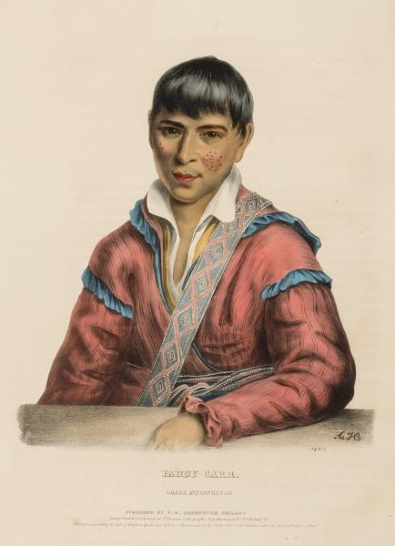

## Homesteaders: David and Martha Jane Ulery

### Paddy Carr

We have seen that military bounty land was often passed on by the beneficiaries, undoubtedly for a small fee, to persons with more money and more of an idea of what to do with the land. This was certainly the case with MW-0229-025, where the bounty land was given to a Native American warrior. The patent says A-Chars-War-Chee was one of the 500 Creek volunteers in Captain Paddy Carr’s Company in the Creek War. This is fascinating to me, so I went off on a tangent, and did some more digging. There is very little hope to find any further information about A-Chars-War-Chee, but Paddy Carr is another matter. There are two Paddy Carr’s in the local history from around 1800 in Georgia. The first one emigrated from Ireland around 1767, started his career as an indian trader, and participated in guerilla warfare in the Revolutionary War.

>    _He was known throughout the South as “Captain Paddy Carr”and the troops he commanded consisted of dragoons and riflemen and were known as "Carr's Independent Corps" and are sometimes referred to as "Carr's Legion."(O’Brien, 1922, p 93)_

Since the first Paddy Carr died in 1802, he cannot possibly have participated in the Creek “Red Stick” War, which was in 1813-1814 (Wikipedia, Creek War). According to the Irish historians, the second Paddy was the son of the first one. The Creek War referred to in the patent must have been the Second Creek War in Florida in 1836 (Wikipedia, Creek War of 1836), and the Paddy Carr mentioned must have been the son.			

>    _Major Carr married a Creek woman and had a son named Patrick, who, like his father, was always known as "Paddy" Carr. In 1826 "Paddy" accompanied a delegation of Indians to Washington and acted as interpreter. He too became a soldier and in 1836 when the Creeks rose he took the side of the United States and marched to Florida with General Jessup at the head of 500 warriors and helped in the suppression of the Indian revolt (O’Brien, 1922, p 95)_

[https://drive.google.com/open?id=1OvngfWlXkBOrMQyUwMzWSniiC5CxKiNe](https://drive.google.com/open?id=1OvngfWlXkBOrMQyUwMzWSniiC5CxKiNe)

We even have a beautiful portrait of the second Paddy Carr, from the Smithsonian’s National Portrait Gallery, done by Alfred M. Hoffy in 1838.

More information about this second Paddy Carr is in McKenney and Hall (1838, p 223-225). It documents his trip as interpreter to Washington, his subsequent career as a trader, slaveholder, and landed gentleman, and his leading of 500 warriors in the Florida campaign.

>    _The young Paddy was born near Fort Mitchell, in Alabama, and, in his infancy, was taken into the family of Colonel Crowell, the Indian agent, and kindly reared in the habits of civilised life (p 223)._

>   _Soon after his return from Washington, he married the daughter of Colonel Lovett, a respectable half breed, with whom he received a portion which, with the property accumulated by himself, furnished a capital sufficient to enable him to go into trade. In a few years he amassed a considerable property, and is now, in 1837, possessed of from seventy to eighty slaves, besides landed property, and a large stock of horses and cattle. (p 223)_

>    _Paddy Carr has an innate passion for fine horses, and owns a large number of very valuable animals. He is fond of racing, and, when he has a trial of speed depending, if he cannot suit himself with a rider, he rides his own horse. He is of a liberal and generous disposition, hospitable to strangers, and kind to the poor. Many of the poorer class of Indians depend on him for support. He has three wives, one of whom is daughter of the ill fated General McIntosh. The two first born of his children were twin girls, and Captain Crowell, the son of his early friend and patron, having a daughter named Ariadne, he called one of his twins Ari and the other Adne, thus evincing a sense of benefits received, which is in itself one of the highest evidences of a noble mind. (p 224)_

Enough of Paddy Carr, and back to the main characters of this chapter. 

### Life and Death

The book by Alley (1885, p. 381) has a short biographical sketch describing David Ulery. I assume Alley actually talked to Ulery, because his book was “_compiled from the most authentic sources_”.

>    _The subject of this sketch was born in Fayette county, Pennsylvania, May 11, 1831, but when fifteen years of age removed to Wheeling, Ohio county, West Virginia, where he was engaged in steamboating. He afterwards joined his parents in Muscatine county, Iowa, and subsequently moved to Minneapolis, and thence to Crawford county, Wisconsin, and there was married to Miss Martha J. Alcorn. In the spring of 1861 he emigrated to California via the isthmus of Panama, and after remaining in Sacramento until July of that year he came to Portland, Oregon, settled on the road between that city and Vancouver and engaged in fruit and vegetable raising for the Portland market. Disposing of that place in 1882, he took up his residence in Clark county, Washington Territory, and in the month of March took possession of the farm he now occupies in the Chelachie valley. His family consists of one son and three daughters, viz. John H., Mary, Rosa and Lena._

Note that Ulery bought the farm one month after receiving 1050 + 1200 + 1200 + 2500 + 700 = 6650 dollars from the sale of his donation land claim in Multnomah County. I am pretty sure that was quite a lot more than he paid A-Chars-War-Chee for the patent.

While living on Vancouver road, David Ulery was active in various public-minded activities. He served on juries and councils, and interacted with his neighbors Evander Howe, John Hotts, William Love, George Smith, and Lewis Love, all of them featuring in various chapters of this book. If appraisals were needed, or documents signings needed to be witnessed, then the neighbors helped each other, undoubtedly also because they were the only people around, living in an isolated area, far from the city. In the Willamette Farmer of March 7, 1874, we see Ulery as active in the Grange movement “_a fraternal organization in the United States that encourages families to band together to promote the economic and political well-being of the community and agriculture_” (Wikipedia). It’s like a rural neighborhood association.

We can also follow David Ulery through the pages of the federal and state censuses. 

[https://drive.google.com/open?id=1U8VH0G83sIc_dwDzT9OUADiaEczNtpy2](https://drive.google.com/open?id=1U8VH0G83sIc_dwDzT9OUADiaEczNtpy2)

In 1850 he was 19 years old, living with his parents in Marshall county, Virginia. His profession was listed as cooper. His future wife Martha Jane Alcorn was 14, and living with her parents in Kiskiminetas, Armstrong, Pennsylvania. In 1870 Ulery was a farmer in the Willamette precinct, Multnomah county, owning $ 2,500 worth of real estate, and accompanied by his wife and children John (12) , Mary (8), Rosa (7), Benj (4) and Lisor Ann (2). In the 1880 federal census Rosa Ann (16), Benjamin (14), and Lissa (12) are still at home. In the 1900 federal census the children are not there anymore, and husband and wife are in Chelatchie county in Washington. They are by now 69 and 64 years old, and the census informs us that of their six children only three are still alive. In the 1910 census David and Martha are 76 and 74. After that, no more. 

The records of the Chelatchi Cemetery in Amboy, Washington (established 1892) show

### References

Michael J. O’Brien: _Major Patrick Carr and Captain Patrice McGriff, two Gallant Officers of the Georgia Continental Line_. The Journal of the American Irish Historical Society, 21, 1922, 97-102 [https://drive.google.com/open?id=1BEmLmHzPeLPdpwkf1KNnxosi9Wvbo0Zc](https://drive.google.com/open?id=1BEmLmHzPeLPdpwkf1KNnxosi9Wvbo0Zc)

Thoma L. McKenney and James Hall: _Biographical Sketches and Anecdotes of Ninety-Five of 120 Principal Chiefs from the Indian Tribes of North America. _United States Department of the Interior, Bureau of Indian Affairs, Report 432, 1838 [https://drive.google.com/open?id=1POMHnkh4sljQSywARyBrYFlMW20R7twL](https://drive.google.com/open?id=1POMHnkh4sljQSywARyBrYFlMW20R7twL)

Wikipedia, _Creek War _[https://en.wikipedia.org/wiki/Creek_War](https://en.wikipedia.org/wiki/Creek_War)

Wikipedia, _Creek War of 1836. [https://en.wikipedia.org/wiki/Creek_War_of_1836](https://en.wikipedia.org/wiki/Creek_War_of_1836)_

Wikipedia, National Grange of the Order of Patrons of Husbandry [https://en.wikipedia.org/wiki/National_Grange_of_the_Order_of_Patrons_of_Husbandry](https://en.wikipedia.org/wiki/National_Grange_of_the_Order_of_Patrons_of_Husbandry)

Federal and Washington State Census Records 1850-1910 [https://drive.google.com/open?id=1U8VH0G83sIc_dwDzT9OUADiaEczNtpy2](https://drive.google.com/open?id=1U8VH0G83sIc_dwDzT9OUADiaEczNtpy2)

B. F. Alley: _History of Clarke County, Washington Territory, Compiled from the most Authentic Sources. Also Biographical Sketches of its Pioneers and Prominent Citizens. _Washington Publishing Company, Portland, Oregon, 1885 [https://drive.google.com/open?id=1lSH0vBcrdK2gx7btAFHorsPdnZ1rgm2e](https://drive.google.com/open?id=1lSH0vBcrdK2gx7btAFHorsPdnZ1rgm2e)
